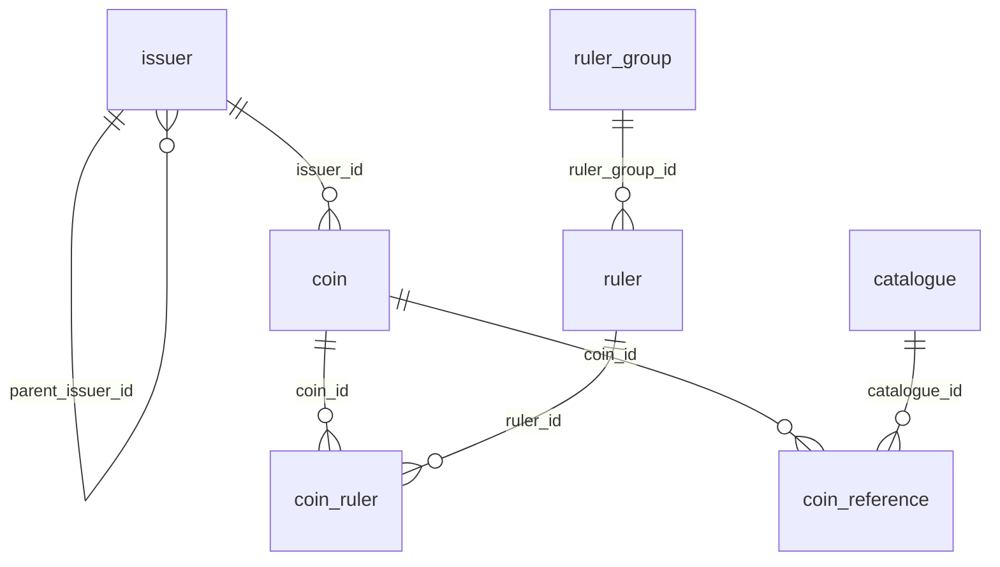

# `@workspace/db`

This README is for maintainers and coding agents changing the database layer. It explains the current Coin Archive database architecture from the package that owns schema, migrations, seed logic, client setup, database tests, and shared queries.

Use the glossary in [`/CONTEXT.md`](/CONTEXT.md) for canonical catalogue language and the ADRs in [`/docs/adr`](/docs/adr) for architectural rationale. This document describes the current database package boundary and behavior; it does not restate the full glossary or ADR history.

## Package boundary

Applications should consume shared database behavior from the database package instead of owning schema details. That means:

- import the shared client, schema exports, types, and query functions from `@workspace/db`
- add reusable query behavior in `packages/db/src/queries`
- add schema and migration changes in `packages/db/src/schema` and `packages/db/migrations`
- keep application code focused on application behavior, not duplicated database ownership

## Core catalogue relationships

Start with the catalogue model, not the tables:

- Coin has exactly one direct Issuer.
- Coin may have zero or more Ruler attributions.
- Ruler Attribution Order matters only within a single Coin's ruler attributions.
- Coin may have zero or more Catalogue References.
- Issuer Grouping places a more specific Issuer under a broader Issuer for browsing and filtering.
- Ruler may belong to an optional Ruler Group.

Important model notes:

- Coin Titles are display labels and should not be parsed into structured catalogue data.
- Issuer Grouping and Ruler Group are different concepts. Issuer Grouping is parent-child browsing structure for Issuers. Ruler Group is an optional flat label attached to a Ruler.
- Catalogue References are external identifiers attached to a Coin. A Reference Number is meaningful only together with its Catalogue.
- Current schema work covers the core catalogue relationships above. Historical, geographic, minting, material, inscription, image, and broader reference information may be modeled later.

## Table mapping

The current core relationships map to these tables:

- `coin`: Coin record with `title`, required direct `issuer_id`, required `distribution_id`, optional catalogue measurements in `weight`, `diameter`, and `thickness`, and optional closed Issue Year Range in `min_year`/`max_year`
- `issuer`: Issuer record with optional `parent_issuer_id` for Issuer Grouping
- `ruler`: Ruler record with optional `ruler_group_id`
- `ruler_group`: optional flat grouping attached to a Ruler
- `coin_ruler`: join table from Coin to Ruler plus per-Coin `ruler_order`
- `catalogue`: external catalogue definition with display `title` and unique `code`
- `coin_reference`: Catalogue Reference attached to a Coin with `catalogue_id` and opaque `number`

## Core ER diagram

## Current database-enforced invariants

These are enforced by the current PostgreSQL schema and exercised by package tests:

- every Coin must have exactly one direct Issuer because `coin.issuer_id` is `NOT NULL` and references `issuer.id`
- every Coin must have exactly one Distribution because `coin.distribution_id` is `NOT NULL` and references `distribution.id`
- Coin Issue Year Range may be unknown with both `min_year` and `max_year` null
- Coin Issue Year Range must be closed when present; half-entered ranges are rejected
- Coin Issue Year Range must satisfy `min_year <= max_year`
- Coin measurements are optional exact decimals stored with two fractional digits
- Weight is stored in grams; Diameter and Thickness are stored in millimeters
- Diameter describes the largest width of the Coin when the Coin is not round
- Coin measurements describe the Coin type or issue, not an individual specimen
- each present Coin measurement must be strictly positive; zero and negative values are rejected
- Issuer Code, Ruler Code, and Ruler Group Code must be unique and lowercase slug-style text
- Catalogue Code is required and unique ignoring case; preferred display casing is still preserved in `catalogue.code`
- an Issuer cannot be its own direct parent
- Ruler may omit `ruler_group_id`
- Coin to Ruler attribution is unique per `(coin_id, ruler_id)`
- Ruler Attribution Order must be positive and unique per Coin through `(coin_id, ruler_order)`
- Catalogue Reference is deduplicated by `(coin_id, catalogue_id, normalized number)` where normalization trims outer whitespace, collapses internal whitespace, and compares case-insensitively
- deleting a Coin cascades to `coin_ruler` and `coin_reference`
- deleting referenced Issuers, Rulers, Ruler Groups, or Catalogues is restricted while dependent rows still exist

## Known gaps and future schema work

These are intentionally separate from the enforced invariants above:

- arbitrary Issuer Grouping cycles are not yet prevented; only self-parenting is blocked today
- the schema does not encode every future catalogue dimension yet; do not infer missing historical, geographic, minting, material, inscription, image, or broader reference structure from `coin.title`
- Coin Titles remain display labels rather than structured facts
- this README documents the current package boundary and behavior, not a promise that every future read model will keep the same shape

## Consumer usage

Consumers should import from `@workspace/db` instead of rebuilding database access locally.

- use `db` when a caller needs direct shared access
- prefer shared query functions such as `getCoins`, `getIssuers`, `getRulers`, and `getCatalogues` for reusable data access behavior
- reuse exported read types from the package when app code needs the package-owned result shape
- keep schema ownership, SQL behavior, and normalization rules in this package so apps do not drift

## Measurement query behavior

The shared `getCoins` query is the package-owned contract for homepage measurement filtering.

- Weight is filtered by exact stored decimal gram values through `minWeight` and `maxWeight`
- Diameter is filtered by exact stored decimal millimeter values through `minDiameter` and `maxDiameter`
- Thickness is filtered by exact stored decimal millimeter values through `minThickness` and `maxThickness`
- each measurement range accepts either bound on its own or both bounds together
- measurement filters compose with each other and with the other `getCoins` filters using AND semantics
- measurement filters do not change the default newest-first ordering
- Coins with unknown values are excluded only for the specific measurement filter that is active

Terminology note:

- use Diameter consistently in schema, docs, and public URL parameter names
- do not introduce Size aliases

## Maintainer workflow

### Schema and migrations

- add or update schema modules in `packages/db/src/schema`
- generate migrations from schema changes with `pnpm db:generate`
- apply migrations to the development database with `pnpm db:migrate`
- commit the schema change and generated migration together

### Shared queries

- add reusable data access in `packages/db/src/queries`
- keep sorting, filtering, joins, and row-to-record mapping in this package when multiple apps or routes should share the same behavior
- add unit or integration coverage next to the query behavior it protects

### Seed data

- keep demo seed data in `packages/db/src/seed/seed-data.ts`
- keep seeding orchestration in `packages/db/src/seed/index.ts`
- keep seeded Coin measurements realistic and varied so the homepage listing demonstrates known and unknown measurement states
- treat seed data as local/demo setup, not as a dependency for behavior tests
- the current demo data intentionally includes:
  - full measurement examples such as `2001 Argentine 1 Peso`
  - unknown Weight with known Diameter and Thickness such as `1896 Argentine 20 Centavos`
  - unknown Diameter with known Weight and Thickness such as `1822 Buenos Aires Decimo`
  - unknown Thickness with known Weight and Diameter such as `1793 Flowing Hair Cent`
- the current demo data also supports a combined homepage verification example:
  - `minWeight=6&maxWeight=7&minDiameter=23&maxDiameter=24&minThickness=1.9&maxThickness=2.1` should isolate `2001 Argentine 1 Peso` after `pnpm db:seed`

### Database tests

- fast package tests run with `pnpm --filter @workspace/db test`
- PostgreSQL integration tests run with `pnpm db:test`
- integration tests use `DATABASE_TEST_URL`, apply migrations before running, and clear known tables between tests
- PostgreSQL must already be running before database tests; if it is not, start it explicitly with `pnpm db:start`

## Environment

- `DATABASE_URL`: development database used by the package client, migrations, seed command, and local database workflows
- `DATABASE_TEST_URL`: dedicated PostgreSQL database for integration tests only; test helpers reject URLs that are not clearly test-specific

See [`.env.example`](/.env.example) for the current local variable names and example values.

## Root database commands

Run these from the repository root:

- `pnpm db:start`: start the PostgreSQL service with Docker Compose
- `pnpm db:stop`: stop the PostgreSQL service
- `pnpm db:reset`: remove PostgreSQL containers and volumes
- `pnpm db:generate`: generate Drizzle migrations from schema changes
- `pnpm db:migrate`: apply migrations to `DATABASE_URL`
- `pnpm db:seed`: load demo seed data into `DATABASE_URL`
- `pnpm db:studio`: open Drizzle Studio
- `pnpm db:test`: run PostgreSQL-backed integration tests against `DATABASE_TEST_URL`

## Package-local commands

These commands are what the root scripts delegate to inside `packages/db`:

- `pnpm --filter @workspace/db typecheck`
- `pnpm --filter @workspace/db test`
- `pnpm --filter @workspace/db run test:db`
- `pnpm --filter @workspace/db run generate`
- `pnpm --filter @workspace/db run migrate`
- `pnpm --filter @workspace/db run seed`
- `pnpm --filter @workspace/db run studio`
