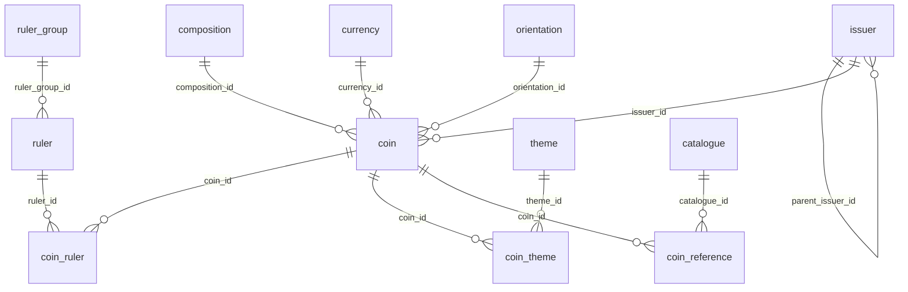

# `@workspace/db`

This README is for maintainers and coding agents changing the database layer. It explains the current Coin Archive database architecture from the package that owns schema, migrations, seed logic, client setup, database tests, and shared queries.

Use the glossary in [`/CONTEXT.md`](/CONTEXT.md) for canonical catalogue language and the ADRs in [`/docs/adr`](/docs/adr) for architectural rationale. This document describes the current database package boundary and behavior; it does not restate the full glossary or ADR history.

## Package boundary

Applications should consume shared database behavior from the database package instead of owning schema details. That means:

- import the shared client, schema exports, types, and query functions from `@workspace/db`
- add reusable query behavior in `packages/db/src/queries`
- add schema and migration changes in `packages/db/src/schema` and `packages/db/migrations`
- keep application code focused on application behavior, not duplicated database ownership

## Core catalogue relationships

Start with the catalogue model, not the tables:

- Coin has exactly one direct Issuer.
- Coin has exactly one Composition.
- Coin has exactly one Face Value.
- Face Value stores authoritative display text, a positive numeric value in the Currency's major unit, and exactly one Currency.
- Currency is a reusable catalogue concept distinct from Issuer.
- Coin may have zero or one Orientation.
- Coin may have zero or more Ruler attributions.
- Coin may have zero or more Theme Attributions.
- Ruler Attribution Order matters only within a single Coin's ruler attributions.
- Coin may have zero or more Catalogue References.
- Issuer Grouping places a more specific Issuer under a broader Issuer for browsing and filtering.
- Ruler may belong to an optional Ruler Group.

Important model notes:

- Coin Titles are display labels and should not be parsed into structured catalogue data.
- Issuer Grouping and Ruler Group are different concepts. Issuer Grouping is parent-child browsing structure for Issuers. Ruler Group is an optional flat label attached to a Ruler.
- Catalogue References are external identifiers attached to a Coin. A Reference Number is meaningful only together with its Catalogue.
- Current schema work covers the core catalogue relationships above. Historical, geographic, minting, material, inscription, image, and broader reference information may be modeled later.

## Table mapping

The current core relationships map to these tables:

- `coin`: Coin record with `title`, required direct `issuer_id`, required `distribution_id`, required `composition_id`, required Face Value fields in `face_value_text`, `face_value_numeric_value`, and `currency_id`, optional public plain-text `comments`, optional `orientation_id`, optional catalogue measurements in `weight`, `diameter`, and `thickness`, and optional closed Issue Year Range in `min_year`/`max_year`
- `composition`: shared Composition record with stable `code`, display `name`, nullable shared `description`, and timestamps
- `currency`: shared Currency record with stable `code`, display `name`, required `full_name`, and timestamps
- `issuer`: Issuer record with optional `parent_issuer_id` for Issuer Grouping
- `orientation`: shared Orientation record with stable `code`, display `name`, and timestamps
- `ruler`: Ruler record with optional `ruler_group_id`
- `ruler_group`: optional flat grouping attached to a Ruler
- `coin_ruler`: join table from Coin to Ruler plus per-Coin `ruler_order`
- `theme`: shared Theme record with stable `code`, display `name`, and timestamps
- `coin_theme`: unordered join table from Coin to Theme
- `catalogue`: external catalogue definition with display `title` and unique `code`
- `coin_reference`: Catalogue Reference attached to a Coin with `catalogue_id` and opaque `number`

## Composition model notes

The `composition` table models the reusable material classification attached directly to each Coin:

- a Composition row defines shared identity and display metadata: UUID primary key, required `code`, required `name`, nullable `description`, and timestamps
- `composition.code` is the stable archive identity for the composition and is the value consumers should use in imports, lookups, filters, and URL-facing query inputs
- `composition.name` is display text only; it helps humans read the material label but is not treated as identity and is allowed to repeat across rows
- `composition.description` is optional shared long-form text for extra material context
- uniqueness and filter matching treat composition codes case-insensitively, while the schema also requires lowercase slug-style text on write
- the schema does not currently trim, slugify, or otherwise normalize `composition.name` or `composition.description` on write; callers must provide the intended persisted text

Composition-specific requirements and constraints:

- every Composition must have a non-null `code`
- every Composition must have a non-null `name`
- Composition Codes must be globally unique ignoring case through `composition_code_lower_unique_idx`
- Composition Codes must satisfy the lowercase slug-style check enforced by `composition_code_slug_check`
- Composition Names do not need to be unique
- Composition Descriptions are optional
- Composition primary keys are database-generated UUIDv7 values
- `created_at` and `updated_at` default at insert time; the current schema does not add an automatic trigger to bump `updated_at` on later updates

Composition-specific indexes and query implications:

- `composition_code_lower_unique_idx` protects the case-insensitive identity rule for composition codes
- `composition_code_lookup_idx` supports shared case-insensitive lookups such as composition filtering in `getCoins`
- `getCompositions` is the package-owned read model for composition options and currently returns `id`, `code`, `name`, `description`, `createdAt`, and `updatedAt`
- `getCompositions` sorts compositions by `name`, then `code`; callers should not depend on insertion order

Relationship and lifecycle notes:

- every Coin must reference exactly one Composition through `coin.composition_id`
- a Composition can be referenced by many Coins
- deleting a Composition is restricted while any Coin still points at it

Known limitations and non-goals:

- the database does not verify that a Composition Name is canonical, chemically precise, or aligned with any external cataloguing standard
- the database does not decompose a Composition into structured percentages, layered alloys, plating metadata, or constituent materials
- the database does not currently prevent semantically overlapping rows with different codes and similar names

## Distribution model notes

The `distribution` table models the shared distribution category attached directly to each Coin:

- a Distribution row defines shared identity and display metadata: UUID primary key, required `code`, required `name`, and timestamps
- `distribution.code` is the stable archive identity for the distribution and is the value consumers should use in imports, lookups, filters, and URL-facing query inputs
- `distribution.name` is display text only; it helps humans read the distribution label but is not treated as identity and is allowed to repeat across rows
- uniqueness and filter matching treat distribution codes case-insensitively, while the schema also requires lowercase slug-style text on write
- the schema does not currently trim, slugify, or otherwise normalize `distribution.name` on write; callers must provide the intended persisted text

Distribution-specific requirements and constraints:

- every Distribution must have a non-null `code`
- every Distribution must have a non-null `name`
- Distribution Codes must be globally unique ignoring case through `distribution_code_lower_unique_idx`
- Distribution Codes must satisfy the lowercase slug-style check enforced by `distribution_code_slug_check`
- Distribution Names do not need to be unique
- Distribution primary keys are database-generated UUIDv7 values
- `created_at` and `updated_at` default at insert time; the current schema does not add an automatic trigger to bump `updated_at` on later updates

Distribution-specific indexes and query implications:

- `distribution_code_lower_unique_idx` protects the case-insensitive identity rule for distribution codes
- `distribution_code_lookup_idx` supports shared case-insensitive lookups such as distribution filtering in `getCoins`
- `getDistributions` is the package-owned read model for distribution options and currently returns `id`, `code`, `name`, `createdAt`, and `updatedAt`
- `getDistributions` sorts distributions by `name`, then `code`; callers should not depend on insertion order

Relationship and lifecycle notes:

- every Coin must reference exactly one Distribution through `coin.distribution_id`
- a Distribution can be referenced by many Coins
- deleting a Distribution is restricted while any Coin still points at it

Known limitations and non-goals:

- the database does not verify that a Distribution Name is canonical, policy-complete, or aligned with any external cataloguing standard
- the database does not encode circulation eligibility, issuance intent, legal-tender status, or market availability rules beyond the selected shared category
- the database does not currently prevent semantically overlapping rows with different codes and similar names

## Currency model notes

The `currency` table models the reusable denomination unit attached to each Coin's Face Value:

- a Currency row defines shared identity and display metadata: UUID primary key, required `code`, required `name`, required `full_name`, and timestamps
- `currency.code` is the stable archive identity for the currency and is the value consumers should use in imports, lookups, filters, and URL-facing query inputs
- `currency.name` is display text only; it helps humans read the short currency label but is not treated as identity and is allowed to repeat across rows
- `currency.full_name` is required shared display text for the fuller currency label and is not treated as identity
- uniqueness and filter matching treat currency codes case-insensitively, while the schema also requires lowercase slug-style text on write
- the schema does not currently trim, slugify, or otherwise normalize `currency.name` or `currency.full_name` on write; callers must provide the intended persisted text

Currency-specific requirements and constraints:

- every Currency must have a non-null `code`
- every Currency must have a non-null `name`
- every Currency must have a non-null `full_name`
- Currency Codes must be globally unique ignoring case through `currency_code_lower_unique_idx`
- Currency Codes must satisfy the lowercase slug-style check enforced by `currency_code_slug_check`
- Currency Names do not need to be unique
- Currency full names do not need to be unique
- Currency primary keys are database-generated UUIDv7 values
- `created_at` and `updated_at` default at insert time; the current schema does not add an automatic trigger to bump `updated_at` on later updates

Currency-specific indexes and query implications:

- `currency_code_lower_unique_idx` protects the case-insensitive identity rule for currency codes
- `currency_code_lookup_idx` supports shared case-insensitive lookups such as currency filtering in `getCoins`
- `getCurrencies` is the package-owned read model for currency options and currently returns `id`, `code`, `name`, `fullName`, `createdAt`, and `updatedAt`
- `getCurrencies` sorts currencies by `name`, then `code`; callers should not depend on insertion order

Relationship and lifecycle notes:

- every Coin must reference exactly one Currency through `coin.currency_id`
- a Currency can be referenced by many Coins
- deleting a Currency is restricted while any Coin still points at it

Known limitations and non-goals:

- the database does not verify that a Currency Name or full name is canonical, historically scoped, or aligned with any external monetary standard
- the database does not model ISO codes, subdivisions, exchange rates, redenomination lineage, or date-bounded validity windows yet
- the database does not currently prevent semantically overlapping rows with different codes and similar display names

## Catalogue model notes

The `catalogue` table is intentionally small because it models the shared external reference work itself, not the per-Coin reference entry:

- a Catalogue row defines only the catalogue identity and display metadata: UUID primary key, required `code`, required `title`, and timestamps
- `catalogue.code` is the stable archive identity for the external catalogue and is the value consumers should use in imports, lookups, filters, and URL-facing query inputs
- `catalogue.title` is display text only; it helps humans read the source name but is not treated as identity and is allowed to repeat across rows
- the schema preserves the preferred display casing stored in `catalogue.code`, but uniqueness and filter matching treat codes case-insensitively
- the schema does not currently trim, slugify, or otherwise normalize `catalogue.code` or `catalogue.title` on write; callers must provide the intended persisted text

Catalogue-specific requirements and constraints:

- every Catalogue must have a non-null `code`
- every Catalogue must have a non-null `title`
- Catalogue Codes must be globally unique ignoring case through `catalogue_code_lower_unique_idx`
- Catalogue Titles do not need to be unique
- Catalogue primary keys are database-generated UUIDv7 values
- `created_at` and `updated_at` default at insert time; the current schema does not add an automatic trigger to bump `updated_at` on later updates

Catalogue-specific indexes and query implications:

- `catalogue_code_lower_unique_idx` protects the case-insensitive identity rule for catalogue codes
- `catalogue_code_lookup_idx` supports shared case-insensitive lookups such as catalogue filtering in `getCoins`
- `catalogue_title_code_sort_idx` supports the shared catalogue option ordering used by `getCatalogues`
- `getCatalogues` is the package-owned read model for catalogue options and currently returns `id`, `code`, `title`, `createdAt`, and `updatedAt`
- `getCatalogues` sorts catalogues by `title`, then `code`; callers should not depend on insertion order

Relationship and lifecycle notes:

- a Catalogue can be referenced by many `coin_reference` rows
- a Coin can hold multiple references from the same Catalogue as long as their normalized `number` values are distinct
- deleting a Coin cascades to its `coin_reference` rows, which may indirectly free an otherwise referenced Catalogue for deletion later
- deleting a Catalogue is restricted while any `coin_reference` row still points at it
- Catalogue References are the join point between a Coin and a Catalogue; do not duplicate reference-number semantics onto the `catalogue` table itself

Normalization and matching notes for Catalogue References:

- `coin_reference.number` is opaque catalogue-assigned text, not a numeric field
- reference deduplication is per Coin and per Catalogue, not global across the archive
- equivalent reference numbers are compared by trimming outer whitespace, collapsing internal whitespace, and lowercasing before uniqueness checks
- catalogue-code filtering in shared queries is case-insensitive
- reference-number filtering in shared queries is normalized with the same whitespace-collapsing and case-folding rules, then matched as a prefix
- when both `catalogueCode` and `referenceNumber` are supplied to `getCoins`, both parts must match the same stored `coin_reference` row

Known limitations and non-goals:

- the database does not verify that a Catalogue Code follows any external standard format beyond being present and unique ignoring case
- the database does not verify that a Catalogue Title is canonical, publication-backed, or synchronized with any outside source
- the database does not model catalogue editions, volumes, publishers, languages, authors, publication dates, or citation metadata yet
- the database does not parse or structure catalogue reference numbers into prefixes, numeric parts, suffixes, or variants
- the database does not currently encode catalogue-specific numbering rules, valid number formats, or cross-catalogue equivalence between references

## Core ER diagram

## Current database-enforced invariants

These are enforced by the current PostgreSQL schema and exercised by package tests:

- every Coin must have exactly one direct Issuer because `coin.issuer_id` is `NOT NULL` and references `issuer.id`
- every Coin must have exactly one Distribution because `coin.distribution_id` is `NOT NULL` and references `distribution.id`
- every Coin must have exactly one Composition because `coin.composition_id` is `NOT NULL` and references `composition.id`
- every Coin must have exactly one Currency-backed Face Value because `coin.currency_id`, `coin.face_value_text`, and `coin.face_value_numeric_value` are required
- Composition Code must be unique ignoring case and use lowercase slug-style text
- Currency Code must be unique ignoring case and use lowercase slug-style text
- Currency Name and Currency full name are required display data, not identities
- Composition Name is required but not unique
- Composition Description is nullable shared long-form text
- Coin Issue Year Range may be unknown with both `min_year` and `max_year` null
- Coin Issue Year Range must be closed when present; half-entered ranges are rejected
- Coin Issue Year Range must satisfy `min_year <= max_year`
- Coin measurements are optional exact decimals stored with two fractional digits
- Face Value numeric value is stored as an exact decimal in the Currency's major unit and must be strictly positive
- Weight is stored in grams; Diameter and Thickness are stored in millimeters
- Diameter describes the largest width of the Coin when the Coin is not round
- Coin measurements describe the Coin type or issue, not an individual specimen
- each present Coin measurement must be strictly positive; zero and negative values are rejected
- Issuer Code, Ruler Code, and Ruler Group Code must be unique and lowercase slug-style text
- Orientation Code must be unique ignoring case and use lowercase slug-style text
- Theme Code must be unique ignoring case and use lowercase slug-style text
- Catalogue Code is required and unique ignoring case; preferred display casing is still preserved in `catalogue.code`
- an Issuer cannot be its own direct parent
- Ruler may omit `ruler_group_id`
- Coin to Ruler attribution is unique per `(coin_id, ruler_id)`
- Coin to Theme Attribution is unique per `(coin_id, theme_id)`
- Ruler Attribution Order must be positive and unique per Coin through `(coin_id, ruler_order)`
- Catalogue Reference is deduplicated by `(coin_id, catalogue_id, normalized number)` where normalization trims outer whitespace, collapses internal whitespace, and compares case-insensitively
- deleting a Coin cascades to `coin_ruler`, `coin_theme`, and `coin_reference`
- deleting referenced Compositions, Issuers, Orientations, Rulers, Ruler Groups, Themes, or Catalogues is restricted while dependent rows still exist

## Known gaps and future schema work

These are intentionally separate from the enforced invariants above:

- arbitrary Issuer Grouping cycles are not yet prevented; only self-parenting is blocked today
- the schema does not encode every future catalogue dimension yet; do not infer missing historical, geographic, minting, material, inscription, image, or broader reference structure from `coin.title`
- Coin Titles remain display labels rather than structured facts
- this README documents the current package boundary and behavior, not a promise that every future read model will keep the same shape

## Consumer usage

Consumers should import from `@workspace/db` instead of rebuilding database access locally.

- use `db` when a caller needs direct shared access
- prefer shared query functions such as `getCoins`, `getCurrencies`, `getIssuers`, `getRulers`, `getMints`, `getOrientations`, `getThemes`, and `getCatalogues` for reusable data access behavior
- `getCoins` returns nested shared catalogue data including each Coin's required Face Value, Currency, and Composition records, nullable public `comments`, nullable Orientation, and nested Mint and Theme collections
- Coin Comments are public display and export data only; they are not filter inputs, search inputs, sort keys, or Coin identity data
- reuse exported read types from the package when app code needs the package-owned result shape
- keep schema ownership, SQL behavior, and normalization rules in this package so apps do not drift
- `getCatalogues` is the shared source for catalogue option lists; keep catalogue ordering and selection logic here rather than reimplementing it in app code

## Query behavior

The shared `getCoins` query is the package-owned contract for homepage filtering, including Face Value, Currency, Issue Year Range, measurements, references, and attribution filters.

- Coin Comments are intentionally excluded from `getCoins` filter options, query matching, and ordering inputs
- changing `comments` must not change which existing filters match a Coin or how the default newest-first Coin ordering behaves
- Demonetization Status is filtered by explicit tri-state values through `demonetization`
- `demonetization=demonetized` returns only Coins with `is_demonetized = true`
- `demonetization=not-demonetized` returns only Coins with `is_demonetized = false`
- `demonetization=unknown` returns only Coins with `is_demonetized is null`
- Demonetization Status filtering is AND-composed with the other `getCoins` filters and does not infer `null` as `false`

- `getThemes` returns reusable Theme options sorted by display name, then code
- `getOrientations` returns reusable Orientation options sorted by display name, then code
- `getCatalogues` returns reusable Catalogue options sorted by title, then code
- Orientation is filtered by exact stable Orientation Code through `orientationCode`
- Orientation filtering is case-insensitive, ignores blank input, returns no Coins for unknown Orientation Codes, and composes with the other `getCoins` filters using AND semantics
- Coins with unknown Orientation are excluded only when `orientationCode` is present
- `getCoins` returns each Coin's nested `themes` sorted deterministically by name, code, then id
- Theme is filtered by exact stable Theme Code through `themeCode`
- Theme filtering is case-insensitive, ignores blank input, returns no Coins for unknown Theme Codes, and composes with the other `getCoins` filters using AND semantics
- Theme filtering uses the same attribution-filter pattern as Mint, so a Coin filtered by one matching Theme still returns all of its stored Themes in the nested `themes` collection

- Catalogue is filtered in `getCoins` by exact stable Catalogue Code through `catalogueCode`
- Reference Number is filtered in `getCoins` by normalized prefix through `referenceNumber`
- Catalogue Code filtering is case-insensitive, ignores blank input, returns no Coins for unknown Catalogue Codes, and composes with the other `getCoins` filters using AND semantics
- Reference Number filtering trims outer whitespace, collapses internal whitespace, compares case-insensitively, and composes with the other `getCoins` filters using AND semantics
- when both `catalogueCode` and `referenceNumber` are present, they must match the same stored Catalogue Reference rather than two different references on the same Coin
- Catalogue Reference filtering does not change the default newest-first Coin ordering

- Currency is filtered by exact stable Currency Code through `currencyCode`
- Face Value is filtered by exact stored major-unit numeric values through `minValue` and `maxValue`
- each Face Value range accepts either bound on its own or both bounds together
- Face Value filtering composes with the other `getCoins` filters using AND semantics
- Face Value filtering does not perform exchange-rate conversion or generated denomination formatting

- Weight is filtered by exact stored decimal gram values through `minWeight` and `maxWeight`
- Diameter is filtered by exact stored decimal millimeter values through `minDiameter` and `maxDiameter`
- Thickness is filtered by exact stored decimal millimeter values through `minThickness` and `maxThickness`
- each measurement range accepts either bound on its own or both bounds together
- measurement filters compose with each other and with the other `getCoins` filters using AND semantics
- measurement filters do not change the default newest-first ordering
- Coins with unknown values are excluded only for the specific measurement filter that is active

Terminology note:

- use Diameter consistently in schema, docs, and public URL parameter names
- do not introduce Size aliases

## Maintainer workflow

### Schema and migrations

- add or update schema modules in `packages/db/src/schema`
- generate migrations from schema changes with `pnpm db:generate`
- apply migrations to the development database with `pnpm db:migrate`
- commit the schema change and generated migration together

### Shared queries

- add reusable data access in `packages/db/src/queries`
- keep sorting, filtering, joins, and row-to-record mapping in this package when multiple apps or routes should share the same behavior
- add unit or integration coverage next to the query behavior it protects

### Seed data

- keep demo seed data in `packages/db/src/seed/seed-data.ts`
- keep seeding orchestration in `packages/db/src/seed/index.ts`
- seed reusable Orientations before seeded Coins so optional `orientation_id` values can be assigned directly
- seed reusable Themes before seeded Coins receive Theme Attributions
- seed reusable Compositions before seeded Coins so every Coin gets an explicit `composition_id`
- seed reusable Currencies before seeded Coins so every Coin gets an explicit `currency_id`
- keep seeded Coin measurements realistic and varied so the homepage listing demonstrates known and unknown measurement states
- treat seed data as local/demo setup, not as a dependency for behavior tests
- local reset and reseed is acceptable when this demo catalogue changes: `pnpm db:reset`, `pnpm db:start`, `pnpm db:migrate`, then `pnpm db:seed`
- keep seeded Coin Compositions and Currencies reusable and explicit so the homepage and shared coin listing demonstrate nested catalogue data
- keep seeded Coin Orientations direct and optional so known and unknown Orientation states both remain visible
- keep seeded Theme Attributions explicit and flat; do not infer Themes from Coin Titles or other display text
- the current demo data intentionally includes:
  - reusable Currencies such as `Euro`, `Argentine peso`, `Real`, and `United States dollar`
  - reusable Orientations such as `Coin alignment` and `Medal alignment`
  - reusable Themes such as `Map`, `Flag`, `Portrait`, `Animal`, `Building`, `Plant`, and `Independence`
  - `Spain 2 Euro` with Face Value text `2 Euros`, numeric value `2`, Currency `Euro`, closed Issue Year Range `2002-2026`, catalogue reference `KM 1338A`, and ruler `Felipe VI`
  - multi-theme Coin examples such as `Spain 2 Euro` and `United States National Park Quarter`
  - at least one unthemed Coin such as `Argentina Copper Peso`
  - full measurement examples such as `Argentina Convertible Peso`
  - partial measurement examples such as `Argentina Copper Peso` and `United States Lincoln Cent`
- the current demo data also supports a combined homepage verification example:
  - `minWeight=6&maxWeight=7&minDiameter=23&maxDiameter=24&minThickness=1.9&maxThickness=2.1` should isolate `Argentina Convertible Peso` after `pnpm db:seed`

### Database tests

- fast package tests run with `pnpm --filter @workspace/db test`
- PostgreSQL integration tests run with `pnpm db:test`
- integration tests use `DATABASE_TEST_URL`, apply migrations before running, and clear known tables between tests
- PostgreSQL must already be running before database tests; if it is not, start it explicitly with `pnpm db:start`

## Environment

- `DATABASE_URL`: development database used by the package client, migrations, seed command, and local database workflows
- `DATABASE_TEST_URL`: dedicated PostgreSQL database for integration tests only; test helpers reject URLs that are not clearly test-specific

See [`.env.example`](/.env.example) for the current local variable names and example values.

## Root database commands

Run these from the repository root:

- `pnpm db:start`: start the PostgreSQL service with Docker Compose
- `pnpm db:stop`: stop the PostgreSQL service
- `pnpm db:reset`: remove PostgreSQL containers and volumes
- `pnpm db:generate`: generate Drizzle migrations from schema changes
- `pnpm db:migrate`: apply migrations to `DATABASE_URL`
- `pnpm db:seed`: load demo seed data into `DATABASE_URL`
- `pnpm db:studio`: open Drizzle Studio
- `pnpm db:test`: run PostgreSQL-backed integration tests against `DATABASE_TEST_URL`

## Package-local commands

These commands are what the root scripts delegate to inside `packages/db`:

- `pnpm --filter @workspace/db typecheck`
- `pnpm --filter @workspace/db test`
- `pnpm --filter @workspace/db run test:db`
- `pnpm --filter @workspace/db run generate`
- `pnpm --filter @workspace/db run migrate`
- `pnpm --filter @workspace/db run seed`
- `pnpm --filter @workspace/db run studio`
